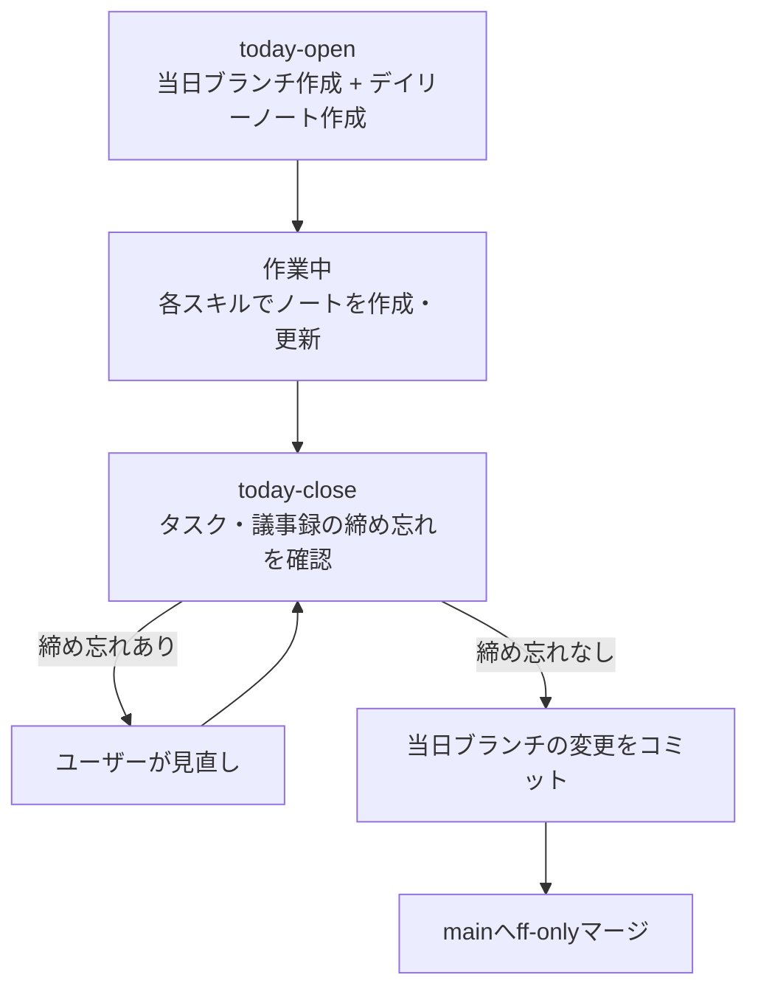
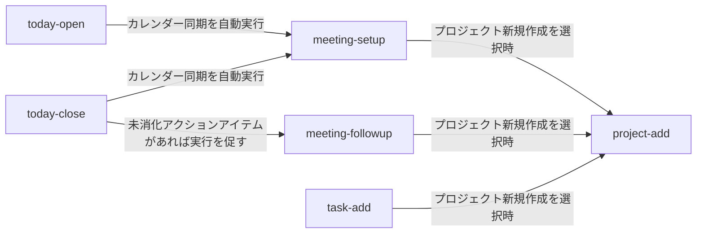

# README（Obsidian×Claude Code環境）

Obsidian VaultとClaude Codeプラグイン`vault`を1リポジトリで管理するモノレポ。
Vault本体（Markdownノート・テンプレート・Bases定義）と、その運用を自動化するClaude Codeスキル群（`.claude/skills/vault/`配下の9スキル）を同居させている。
両者は密結合しており、スキルが読み書きする対象はVault自身のノートである。

このドキュメントは、このリポジトリを初めて触る人が迷わずセットアップ・利用開始できることを目的とする。

## 目次

- [前提知識](#前提知識)
- [セットアップ手順](#セットアップ手順)
- [使い方](#使い方)
- [ファイル・フォルダ構成](#ファイルフォルダ構成)
- [スキル一覧](#スキル一覧)
- [Bases定義](#bases定義)
- [テストの実行方法](#テストの実行方法)

## 前提知識

このリポジトリ固有ではなく、Obsidianユーザー一般に共通する前提知識を先に押さえる。

### PARA法

PARA法は、ノートを次の4カテゴリで整理する手法である。

- **Projects**: 進行中の目標
- **Areas**: 継続的に責任を持つ領域
- **Resources**: 将来参照する可能性のある資料
- **Archives**: 非アクティブになった全て

このリポジトリでは、この4カテゴリに運用上の補助フォルダを加えている。

- `00_Inbox`: 未整理メモ
- `10_Daily`: デイリーノート
- `80_Templates`: テンプレート
- `81_Attachments`: 添付ファイル
- `82_Bases`: Bases定義
- `90_SkillFlows`: スキルの動作フロー説明

さらに`00_`〜`90_`の数字プレフィックスで、ファイルツリー上の表示順を固定している。
具体的な対応は後述の「ファイル・フォルダ構成」を参照。

### Obsidian Base機能

Obsidian Baseは、ノートのfrontmatter（YAMLプロパティ）を条件にフィルタ・ソートし、テーブルやカードとして一覧表示する、Obsidian本体に組み込まれたコア機能である。
`*.base`ファイルとしてビュー定義を保存し、プラグインを追加インストールすることなくデータベース的な検索・集計ができる。

## セットアップ手順

Windows（Git Bash）環境を前提に記載する。

### 必要なもの

- **Git**: `today-open`／`today-close`スキルがブランチ作成・コミット・mainへのマージを行うため必須。
- **Python**: `scripts/*.py`本体は標準ライブラリのみで動作し追加パッケージ不要。動作確認済み環境は3.14.3（`.claude/skills/vault/scripts/.venv/pyvenv.cfg`より）。テスト実行にはpytest（動作確認済み: 9.1.1）が必要である。`.claude/skills/vault/scripts/.venv/`に閉じたテスト専用の仮想環境を別途作る運用になっている。
- **Obsidian本体**: Vaultの閲覧・編集用。設定の「コアプラグイン」で「Bases」を有効化する必要がある（`.obsidian/core-plugins.json`で`"bases": true`を確認済み）。
- **Claude Code CLI**: スキルを実行するために必須。9スキル分のSKILL.mdは`.claude/skills/vault/skills/<name>/SKILL.md`に配置されており、このリポジトリをClaude Codeで開いて利用する運用である。有効化の仕組み（`.claude/settings.json`が存在せず、`.claude-plugin/plugin.json`も`.claude/skills/vault/`配下という通常と異なる位置にある）は未確認。
- **Google Calendar MCP**（`list_events`ツール）: `meeting-setup`スキルに必須。未接続の場合`meeting-setup`は動作しない。`today-open`／`today-close`はカレンダー同期のために`meeting-setup`を自動的に呼び出す。ただし、そこが失敗しても両スキル本来の処理（ブランチ作成・コミット等）は継続される。
- **Playwright MCP**（`mcp__plugin_playwright_playwright__browser_navigate`等）: `webclip-add`スキルに必須。未接続の場合、`webclip-add`はユーザーにセットアップを促して処理を中断する。
- **Microsoft 365 MCP**: 任意。現状このリポジトリでは未接続。接続時のフィールド対応は[`references/meeting-field-mapping.md`](.claude/skills/vault/references/meeting-field-mapping.md)を参照。

### 手順

このリポジトリは現状リモート未設定のローカルGit運用である（`git remote -v`の出力なしで確認済み）。共有・複製する場合は各自の方法でリモートを設定した上で、以下はリポジトリのルートで作業する前提とする。

1. Obsidianで「フォルダを開く」からリポジトリのルートをVaultとして開く。設定 → コアプラグイン → 「Bases」が無効な場合は有効化する。
2. Claude Code CLIをリポジトリのルートで起動する。

   ```bash
   cd obsidian
   claude
   ```

   9スキル分のSKILL.mdは`.claude/skills/vault/skills/<name>/SKILL.md`に配置されている。有効化の具体的な仕組みは未確認のため、動作しない場合はClaude Code側のプラグイン・スキル設定を確認すること。
3. 必要に応じて`claude mcp`コマンドでGoogle Calendar MCP・Playwright MCPを追加する（追加構文はMCPサーバー側の提供方法に依存するため本書では規定しない）。
4. テスト専用の仮想環境を作成し、pytestをインストールする。

   ```bash
   cd .claude/skills/vault/scripts
   python -m venv .venv
   .venv/Scripts/pip install pytest
   ```

5. 起動確認としてテストスイートを実行する（詳細は後述の「テストの実行方法」）。

   ```bash
   PYTHONUTF8=1 .venv/Scripts/python -m pytest
   ```

   全件成功すればセットアップ完了。

### Obsidian設定

手順1でVaultとして開いた後、以下の設定を行う。

**外観**

- テーマを`Typora-Vue`にする

**インターフェース**

- リボンの表示をオフにする

**エディタ**

- 新規タブのデフォルトビューをリーディングビューにする
- インラインタイトルをオフにする
- 読みやすい行の長さをオフにする
- 行番号をオンにする
- ノートにMermaid図を表示をオンにする

**ファイルとリンク**

- 起動時に開くファイルをデイリーノートにする
- 新規ノートの作成場所を`00_Inbox`にする
- 新規添付ファイルの作成場所を`81_Attachments`にする
- 内部リンクを毎回更新するをオンにする
- すべてのファイル拡張子を認識をオンにする

**ホットキー**

- 今日のデイリーノートを開くに`Ctrl+D`を割り当てる
- テンプレートを挿入に`Ctrl+Shift+N`を割り当てる

よく使うデフォルトのホットキー:

| ホットキー | 操作 |
|-----------|------|
| `Ctrl+N` | 新規ノート作成 |
| `Ctrl+G` | グラフビューを開く |
| `Ctrl+O` | クイックスイッチャーを使う |
| `Ctrl+E` | 編集モードとプレビューモードを切り替え |
| `Ctrl+B` | 太字にする |

**クイックスイッチャー**

- すべての種類のファイルを表示をオンにする

**デイリーノート**

- 新規ファイルの場所を`10_Daily`にする
- テンプレートファイルの場所を`80_Templates/Daily_Template`にする

## 使い方

### 日次ワークフロー

1日の作業は`today-open`で始め`today-close`で終える。



1. `today-open`を実行し、当日ブランチ（`YYYY-MM-DD`形式）を作成してデイリーノートを用意する。
2. 作業中は必要に応じて他のスキルを実行し、当日ブランチ上にノートを蓄積する。
3. `today-close`を実行する。タスク・議事録の締め忘れが検出された場合は見直しを済ませてから再実行し、問題がなければ当日ブランチの変更をコミットして`main`へff-onlyマージする。

ブランチ運用の詳細ルールは[CLAUDE.md](CLAUDE.md)を参照。

### スキル間の連携

`today-open`／`today-close`はカレンダー同期のために`meeting-setup`を自動的に呼び出す。
`today-close`は議事録の未消化アクションアイテムを検知すると`meeting-followup`の実行を促す（処理は中断しない）。
`meeting-setup`／`meeting-followup`／`task-add`はいずれも、プロジェクト割当の確認時に「新規プロジェクトを作成する」を選ぶと`project-add`を呼び出す。
`knowhow-add`／`webclip-add`／`task-gantt`はこれらの連携を持たず単独で完結する。



### スキルの呼び出し方

各スキルは発話トリガーまたはスラッシュコマンドで起動する。

| スキル | トリガー発話例 | スラッシュコマンド |
|--------|----------------|--------------------|
| `today-open` | 「今日を始める」「デイリーノート作って」 | `/today` |
| `meeting-setup` | 「議事録を作って」「今日の会議のノート作って」 | `/meeting-setup` |
| `task-add` | 「タスクにして」「これタスク化して」 | `/task-add` |
| `meeting-followup` | 「議事録からタスク化して」「アクションアイテムを整理して」 | `/meeting-followup <議事録ノート>` |
| `webclip-add` | 「このページをクリップして」「Webクリップ作って」 | `/webclip <URL>` |
| `knowhow-add` | 「これノウハウとして残して」「ナレッジ化して」 | `/knowhow` |
| `project-add` | 「プロジェクトを始めて」「新規プロジェクト作って」 | `/project <name>` |
| `task-gantt` | 「ガントチャート作って」「タスクの進捗を可視化して」 | `/task-gantt` |
| `today-close` | 「今日を終わる」「クローズして」 | `/close` |

## ファイル・フォルダ構成

### リポジトリ直下

```
obsidian/
├── .claude/
│   └── skills/vault/          # Claude Codeプラグイン本体（後述）
├── 00_Inbox/                  # 人が手動で書く未整理メモ（frontmatter規約なし、Base集計対象外）
├── 10_Daily/                  # デイリーノート（today-openが作成）
├── 20_Projects/
│   └── <プロジェクト名>/
│       ├── <プロジェクト名>.md
│       ├── Tasks/
│       ├── Meetings/
│       └── Documents/
├── 30_Areas/
│   ├── Meetings/              # プロジェクトに紐付かない議事録
│   └── Tasks/                 # プロジェクトに紐付かないタスク
├── 40_Resources/              # プロジェクトに紐付かないドキュメントの格納先
│   ├── Documents/             # プロジェクトに紐付かない資料置き場
│   ├── Knowledge/             # ナレッジノート（knowhow-addが整形）
│   └── WebClips/              # Webクリップ（webclip-addが保存）
├── 50_Archives/                # 完了・非アクティブになったノートの置き場
├── 80_Templates/               # 各ノート種別のテンプレート
├── 81_Attachments/             # 画像等の添付ファイル
├── 82_Bases/                   # Obsidian Bases定義（*.base、後述）
├── 90_SkillFlows/               # 各スキルの動作フロー説明
├── CLAUDE.md                    # このリポジトリ固有の運用ルール
└── README.md
```

### プラグイン内部（`.claude/skills/vault/`）

```
.claude/skills/vault/
├── .claude-plugin/
│   └── plugin.json            # プラグイン定義（name/version/description）
├── skills/
│   └── <skill-name>/SKILL.md  # 各スキルの仕様（9スキル分）
├── scripts/
│   ├── vault_lib.py           # 共通ヘルパー（ファイル名サニタイズ・プロジェクト紐付け等）
│   ├── <name>_*.py            # 各スキルのエントリポイント
│   ├── tests/                 # pytestテスト
│   └── .venv/                 # テスト専用仮想環境（git管理外）
└── references/                # スキル横断の設計ドキュメント（5ファイル）
```

## スキル一覧

各スキルの目的・入力・出力の詳細は個別のSKILL.mdを参照。

| スキル | 役割 | SKILL.md |
|--------|------|----------|
| `today-open` | 当日ブランチを作成し、デイリーノートを新規作成する（1日の作業開始） | [SKILL.md](.claude/skills/vault/skills/today-open/SKILL.md) |
| `meeting-setup` | Google Calendarの予定から議事録ノートを作成・更新し、その場でプロジェクト割当まで確認する | [SKILL.md](.claude/skills/vault/skills/meeting-setup/SKILL.md) |
| `task-add` | ユーザーの発話・CLI入力から単発のタスクノートを作成する | [SKILL.md](.claude/skills/vault/skills/task-add/SKILL.md) |
| `meeting-followup` | 議事録ノートのアクションアイテムをタスク化し、開催状況を確認する | [SKILL.md](.claude/skills/vault/skills/meeting-followup/SKILL.md) |
| `webclip-add` | 指定URLのWebページをPlaywright MCP経由で要約・画像保存してノート化する | [SKILL.md](.claude/skills/vault/skills/webclip-add/SKILL.md) |
| `knowhow-add` | 雑多なメモ・ログをナレッジノートとして整形保存する | [SKILL.md](.claude/skills/vault/skills/knowhow-add/SKILL.md) |
| `project-add` | プロジェクト概要ノートとTasks/Meetings/Documentsフォルダを一括作成する | [SKILL.md](.claude/skills/vault/skills/project-add/SKILL.md) |
| `task-gantt` | Vault横断で全タスクノートを集計し、プロジェクト別のMermaid ganttチャートを当日デイリーノートに書き込む | [SKILL.md](.claude/skills/vault/skills/task-gantt/SKILL.md) |
| `today-close` | タスク・議事録の締め忘れを確認し、当日ブランチの変更をコミットしmainへマージする（1日の作業終了） | [SKILL.md](.claude/skills/vault/skills/today-close/SKILL.md) |

## Bases定義

`82_Bases/`配下のObsidian Basesビュー定義。対応するノート種別を一覧・フィルタ表示する。

| ファイル | 対象 |
|----------|------|
| `Knowledge.base` | `type in ["knowhow", "webclip"]`のノート（Knowhow・WebClipを一括管理。全件・カテゴリ別の2ビュー） |
| `Meetings.base` | `type == "meeting"`／`"meeting_series"`のノート |
| `Projects.base` | `20_Projects/`配下の`type == "project"`のノート |
| `Tasks.base` | `type == "task"`のノート |

## テストの実行方法

```bash
cd .claude/skills/vault/scripts
PYTHONUTF8=1 .venv/Scripts/python -m pytest
```

現在230件全て成功する。`.venv`が未作成の場合は前述の「セットアップ手順」を先に実施する。
