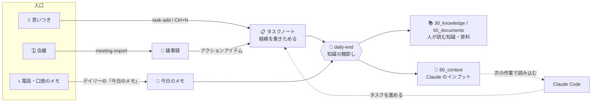
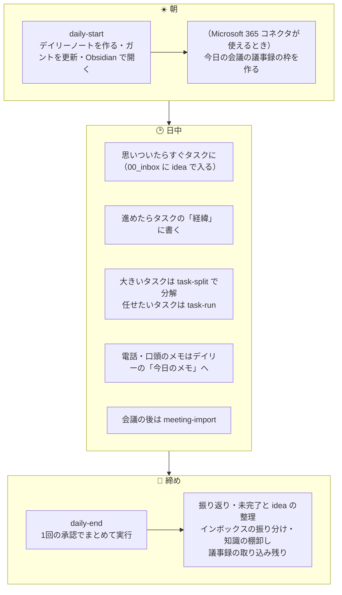
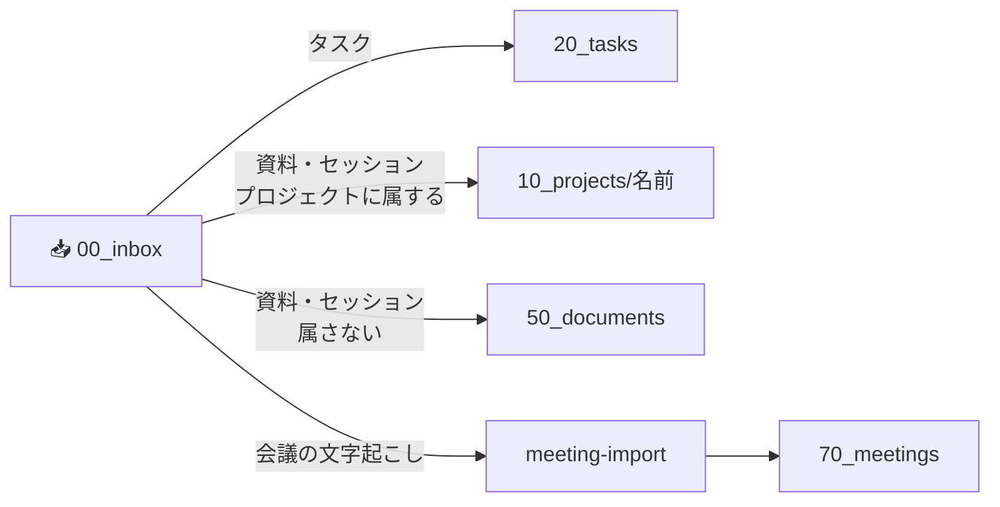
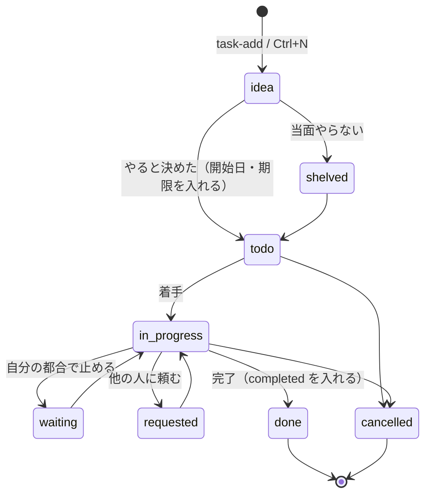
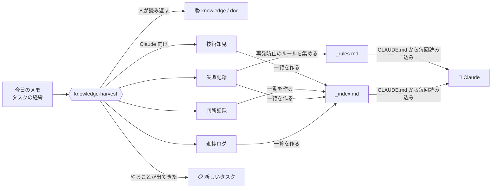
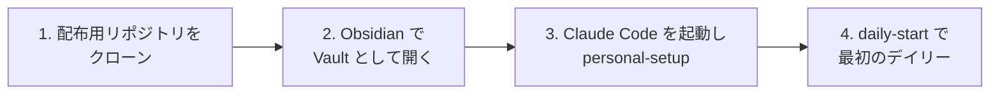

# Vault — Obsidian × Claude Code の「第2の脳」

思いついたことはすべて**タスク**として受け止め、進めた経緯をタスクノートに書きためます。1日の終わりに Claude がそれを**棚卸し**して、人が読む知識と、Claude が次の作業で読むインプットに仕分けます。

> この README は人が読むための案内です。Claude が守る規約は [CLAUDE.md](CLAUDE.md)、別の PC で環境を作る手順は [90_system/setup.md](90_system/setup.md) にあります。

---

## 目次
1. [全体像](#全体像)
2. [1日の流れ](#1日の流れ)
3. [フォルダ構成](#フォルダ構成)
4. [タスクの一生](#タスクの一生)
5. [デイリーノート（その日のダッシュボード）](#デイリーノートその日のダッシュボード)
6. [棚卸しと Claude のインプット](#棚卸しと-claude-のインプット)
7. [スキル一覧](#スキル一覧)
8. [自動で動くもの](#自動で動くもの)
9. [ファイルの役割分担](#ファイルの役割分担)
10. [はじめかた](#はじめかた)
11. [気をつけること](#気をつけること)

---

## 全体像

入口はタスクの1本だけです。電話のメモや会議のアクションアイテムも、最後はタスクか知識に流れ込みます。


```mermaid
flowchart LR
    subgraph 入口
        A1["💡 思いつき"]
        A2["📞 電話・口頭のメモ"]
        A3["🗓️ 会議"]
    end

    A1 -->|task-add / Ctrl+N| T["📋 タスクノート<br/>経緯を書きためる"]
    A2 -->|デイリーの「今日のメモ」| M["📝 今日のメモ"]
    A3 -->|meeting-import| MT["📄 議事録"]
    MT -->|アクションアイテム| T

    T --> H{{"🌙 daily-end<br/>知識の棚卸し"}}
    M --> H

    H --> K["📚 30_knowledge / 50_documents<br/>人が読む知識・資料"]
    H --> C["🤖 80_context<br/>Claude のインプット"]
    C -.->|次の作業で読み込む| CL["Claude Code"]
    CL -.->|タスクを進める| T
```

---

## 1日の流れ


```mermaid
flowchart TB
    subgraph 朝["☀️ 朝"]
        S1["daily-start<br/>デイリーノートを作る・ガントを更新・Obsidian で開く"]
        S2["（Microsoft 365 コネクタが使えるとき）<br/>今日の会議の議事録の枠を作る"]
        S1 --> S2
    end
    subgraph 日中["🕑 日中"]
        D1["思いついたらすぐタスクに<br/>（00_inbox に idea で入る）"]
        D2["進めたらタスクの「経緯」に書く"]
        D3["大きいタスクは task-split で分解<br/>任せたいタスクは task-run"]
        D4["電話・口頭のメモはデイリーの「今日のメモ」へ"]
        D5["会議の後は meeting-import"]
    end
    subgraph 締め["🌙 締め"]
        E1["daily-end<br/>1回の承認でまとめて実行"]
        E2["振り返り・未完了と idea の整理<br/>インボックスの振り分け・知識の棚卸し<br/>議事録の取り込み残り"]
        E1 --> E2
    end
    朝 --> 日中 --> 締め
```

| 時間帯 | やること | 使うもの |
|---|---|---|
| 朝 | デイリーノートを開く | `daily-start`（PC の起動時に自動で動かせる） |
| 日中 | 思いつきをタスクにする | Obsidian: `Ctrl+N` → `Ctrl+Shift+N`（タスクのテンプレート）／ Claude: `task-add` |
| 日中 | 経緯を書く | タスクノートの「経緯」に `### 日付` で追記 |
| 日中 | 会議の議事録を作る | `meeting-import` |
| 締め | 1日をまとめる | `daily-end` |

---

## フォルダ構成

フォルダ名の番号は、並び順を固定するためのものです（`40` は空き番号）。アーカイブ用のフォルダはなく、完了・中止したものは**状態（status）を変えて元の場所に置いたまま**にします。

```
vault/
├── 00_inbox/        📥 振り分け前のタスク・資料・文字起こし（Obsidian の新規ノートもここ）
├── 10_projects/     📁 プロジェクトごとのフォルダ（ノート本体と資料）
├── 20_tasks/        📋 振り分け済みのタスク（1タスク1ノート）
├── 30_knowledge/    📚 人が読む知識（解説・手順・ノウハウ・調べもの）
├── 50_documents/    📄 プロジェクトに属さない資料
├── 60_daily/        📅 デイリーノート（YYYY-MM-DD.md）
├── 70_meetings/     🗓️ 議事録（YYYY-MM-DD_会議名.md）
├── 80_context/      🤖 Claude のインプット（技術知見・判断記録・失敗記録・進捗ログ）
└── 90_system/       ⚙️ テンプレート・Bases・添付・スキルの解説・セットアップ手順
```

インボックスのものは、`daily-end` が次のように振り分ける案を出し、承認すると移します。


```mermaid
flowchart LR
    I["📥 00_inbox"] -->|タスク| T["20_tasks"]
    I -->|資料・セッション<br/>プロジェクトに属する| P["10_projects/名前"]
    I -->|資料・セッション<br/>属さない| D["50_documents"]
    I -->|会議の文字起こし| MI["meeting-import"] --> MT["70_meetings"]
```

---

## タスクの一生

主な流れを示しています（これ以外の移り方を禁止しているわけではありません）。


```mermaid
stateDiagram-v2
    [*] --> idea: task-add / Ctrl+N
    idea --> todo: やると決めた（開始日・期限を入れる）
    idea --> shelved: 当面やらない
    todo --> in_progress: 着手
    in_progress --> waiting: 自分の都合で止める
    in_progress --> requested: 他の人に頼む
    waiting --> in_progress
    requested --> in_progress
    in_progress --> done: 完了（completed を入れる）
    todo --> cancelled
    in_progress --> cancelled
    shelved --> todo
    done --> [*]
    cancelled --> [*]
```

| 状態 | 意味 | ダッシュボードでの表示 |
|---|---|---|
| `idea` | 思いつき。やるかは未定 | 「アイデア・インボックス」 |
| `todo` | やると決めたが未着手 | 開始日を過ぎると「遅れ」 |
| `in_progress` | 作業中 | 「作業中」 |
| `waiting` | 保留（自分の都合や前提待ち） | 「保留」（ガントでは ⏸） |
| `requested` | 依頼中（他の人の返事待ち） | 「依頼中」（ガントでは ✉） |
| `done` | 完了 | その日だけ「今日完了」 |
| `shelved` | 塩漬け（捨てないが当面やらない） | 出さない |
| `cancelled` | 中止（削除の代わり） | 出さない |

タスクノートの中身はこうなっています。

| 見出し | 書くこと |
|---|---|
| 完了条件 | 何ができたら終わりか（`task-run` で一緒に決める。任意） |
| チェックリスト | 細かい作業と期限。マーカーの間に書いた項目はガントに ◇ で出る |
| 経緯 | 日ごとの進み具合。**ここが棚卸しの材料になる** |
| 成果 | 成果物と、棚卸しで作ったノートへのリンク |

---

## デイリーノート（その日のダッシュボード）

`60_daily/YYYY-MM-DD.md` は、その日の状況を1枚で見るためのノートです。

| 順 | セクション | 中身 |
|---|---|---|
| 1 | 進行中のプロジェクト | `active` のプロジェクト一覧 |
| 2 | 今日の会議 | 今日の日付の議事録 |
| 3 | タスク | 下の区分でまとめた表 |
| 4 | アイデア・インボックス | `idea` と、`00_inbox` にある未完了のタスク |
| 5 | ガントチャート | 今日から90日分の予定（自動生成） |
| 6 | 今日のメモ | 電話・口頭の突発メモ（締めで振り分け） |
| 7 | 振り返り | `daily-end` が書く |

タスクの表は、上から順に**最初に当てはまった区分にだけ**出ます。


```mermaid
flowchart LR
    L["1 遅れ 🔴"] --> T["2 今日が期限"] --> W["3 作業中"] --> R["4 依頼中"] --> H["5 保留"] --> D["6 今日完了"]
```

「遅れ」になる条件:
- `todo` で、開始日が今日以前
- `in_progress` / `waiting` / `requested` で、期限が今日より前

---

## 棚卸しと Claude のインプット

締めの `daily-end` から `knowledge-harvest` が動き、「今日のメモ」と、前回の棚卸し以降に更新したタスクの「経緯」から、残す価値のあるものを取り出します。取り出した行の末尾には ` → [[ノート名]]` の印が付きます（二重に取り出さないため）。


```mermaid
flowchart LR
    SRC["今日のメモ<br/>タスクの経緯"] --> H{{"knowledge-harvest"}}
    H -->|人が読み返す| K["📚 knowledge / doc"]
    H -->|Claude 向け| C1["技術知見"]
    H --> C2["判断記録"]
    H --> C3["失敗記録"]
    H --> C4["進捗ログ"]
    H -->|やることが出てきた| T["📋 新しいタスク"]
    C3 -->|再発防止のルールを集める| R["_rules.md"]
    C1 & C2 & C3 & C4 -->|一覧を作る| I["_index.md"]
    R & I -->|CLAUDE.md から毎回読み込み| CL["🤖 Claude"]
```

| ファイル（`80_context/`） | 中身 | 例 |
|---|---|---|
| 技術知見 | Claude の作業に効く短い知見 | 「このツールは〇〇の癖がある」 |
| 判断記録 | 背景・選択肢・決定・理由・影響・見直す条件 | 「通知は応答ごとにする」 |
| 失敗記録 | 何が起きたか・原因・対策・再発防止のルール | 「〇〇で失敗した。次からは△△する」 |
| 進捗ログ | プロジェクトごとの現在の要約と日付の記録 | 「Vaultの改善: 第3期を実装済み」 |

会話の途中で何かを決めたり失敗したりしたときも、Claude が「判断記録／失敗記録に残しますか」と聞いてくれます。

---

## スキル一覧

Claude Code に話しかけると、場面に合ったスキルが動きます。`/スキル名` で直接呼ぶこともできます。各スキルの詳しい解説は [90_system/skill-docs/](90_system/skill-docs/) にあります。

| 場面 | スキル | 何をするか |
|---|---|---|
| ☀️ 朝 | [daily-start](90_system/skill-docs/daily-start.md) | デイリーノートを作り、ガントを更新して Obsidian で開く |
| 📋 タスクを作る | [task-add](90_system/skill-docs/task-add.md) | 名前だけで `00_inbox` に `idea` のタスクを作る |
| ✂️ 大きいタスク | [task-split](90_system/skill-docs/task-split.md) | チェックリスト（マイルストーン）に分解する |
| 🤝 任せる | [task-run](90_system/skill-docs/task-run.md) | 完了条件を決め、Claude が裏で進めて結果を書き込む（Vault の中の作業だけ） |
| 🗓️ 会議の後 | [meeting-import](90_system/skill-docs/meeting-import.md) | 議事録を作り、アクションアイテムをタスクにする |
| 🌙 締め | [daily-end](90_system/skill-docs/daily-end.md) | 振り返り・整理・振り分け・棚卸しを1回の承認でまとめて行う |
| 📚 棚卸しだけ | [knowledge-harvest](90_system/skill-docs/knowledge-harvest.md) | メモと経緯から知識とインプットを作る |
| 📊 ガントだけ | [gantt-update](90_system/skill-docs/gantt-update.md) | 今日のデイリーノートのガントを作り直す |
| 📁 プロジェクト | [project-add](90_system/skill-docs/project-add.md) | プロジェクトのノートとフォルダを作る |
| 💬 考えを詰める | [grilling-html](90_system/skill-docs/grilling-html.md) | HTML のフォームで質問に答えて内容を固める |
| 👤 個人の設定 | [personal-setup](90_system/skill-docs/personal-setup.md) | `PERSONAL.md` をインタビュー形式で作る |
| 📖 スキルの解説 | [skill-explain](90_system/skill-docs/skill-explain.md) | スキルを読んで解説ノートを作る |

---

## 自動で動くもの

Claude Code の**フック**（`.claude/settings.json` に登録）が、決まったタイミングで動きます。

| タイミング | 動き |
|---|---|
| Claude Code を起動したとき | 今日のガントを更新し、「遅れ」「今日が期限」「idea」「インボックス」の件数を Claude に伝える |
| Claude がタスクを編集した直後 | ガントを自動で更新する |
| Claude の応答が終わるたび | Windows の通知で「完了」と、作成・編集したファイルを知らせる（クリックで Obsidian が開く） |
| 許可や入力を待っているとき | Windows の通知で「確認待ち」を知らせる |
| PC にログオンしたとき（任意） | スタートアップに置いた `daily-start.bat` が `daily-start` を動かす |

> Obsidian でタスクを編集しても、ガントはすぐには変わりません。次に Claude Code を起動したときか、`gantt-update` で反映されます。

---

## ファイルの役割分担

| ファイル | 読み手 | 書いてあること |
|---|---|---|
| `README.md`（これ） | 人 | 全体像・使い方の案内 |
| [CLAUDE.md](CLAUDE.md) | Claude（毎回読み込む） | どのノートにも効く規約（フォルダ・プロパティ・安全・Git） |
| [.claude/rules/](.claude/rules/) | Claude（該当のフォルダを触るときだけ読み込む） | タスク・議事録・デイリー・知識ごとの細かい書き方 |
| [.claude/skills/](.claude/skills/) | Claude（呼ばれたときに読み込む） | 各スキルの手順 |
| [90_system/skill-docs/](90_system/skill-docs/) | 人 | 各スキルの解説 |
| [90_system/setup.md](90_system/setup.md) | 人 | 別の PC で環境を作る手順 |
| `PERSONAL.md` | Claude | この PC・この利用者に固有の設定（Git では配らない） |
| `80_context/` | Claude | 棚卸しで集めた判断・失敗・知見・進捗 |

---

## はじめかた

詳しくは [90_system/setup.md](90_system/setup.md) を見てください。流れはこうです。


```mermaid
flowchart LR
    A["1. 配布用リポジトリを<br/>クローン"] --> B["2. Obsidian で<br/>Vault として開く"]
    B --> C["3. Claude Code を起動し<br/>personal-setup"]
    C --> D["4. daily-start で<br/>最初のデイリー"]
```

- 必要なもの: Windows、Obsidian、Git、Python 3、Node.js、Google Chrome、Claude Code
- Obsidian の設定（新規ノートの作成先・添付の保存先・ホットキーなど）は `.obsidian/` に入っているので、手で設定しなくて大丈夫です。

よく使う Obsidian の操作:

| キー | 動き |
|---|---|
| `Ctrl+N` → `Ctrl+Shift+N` | `00_inbox` に新しいノートを作り、テンプレート（タスクなど）を挿入する |
| `Ctrl+D` | 今日のデイリーノートを開く |
| `70_meetings` を右クリック →「新規ノート」→ `Ctrl+Shift+N` | 議事録を手で作る |

---

## 気をつけること

- 💾 **ノートは Git で管理していません。** 誤って消したノートを戻せるのは、Obsidian のコアプラグイン「ファイル復元」（5分ごとに保存、7日間保管）だけです。
- 🗑️ タスクは削除せず、中止なら `cancelled` にします。
- 🔒 Git は、この環境（スキル・フック・設定・テンプレートなど）を他の PC に配るためだけに使います。ノートと `PERSONAL.md` は追跡しません。コミットと push は手で行います。
- 🔑 トークンやキーなどの秘密情報は、ノートにもコミットにも書かないでください。
